# Домашнее задание к занятию 7 «Жизненный цикл ПО» - Михалёв Сергей

1. Создайте задачу с типом bug, попытайтесь провести его по всему workflow до Done. 
1. Создайте задачу с типом epic, к ней привяжите несколько задач с типом task, проведите их по всему workflow до Done. 
1. При проведении обеих задач по статусам используйте kanban. 
1. Верните задачи в статус Open.
1. Перейдите в Scrum, запланируйте новый спринт, состоящий из задач эпика и одного бага, стартуйте спринт, проведите задачи до состояния Closed. Закройте спринт.
2. Если всё отработалось в рамках ожидания — выгрузите схемы workflow для импорта в XML. Файлы с workflow и скриншоты workflow приложите к решению задания.

**Решение**
1. Создал задачу с типом bug, провёл его по всему workflow до Done. 
     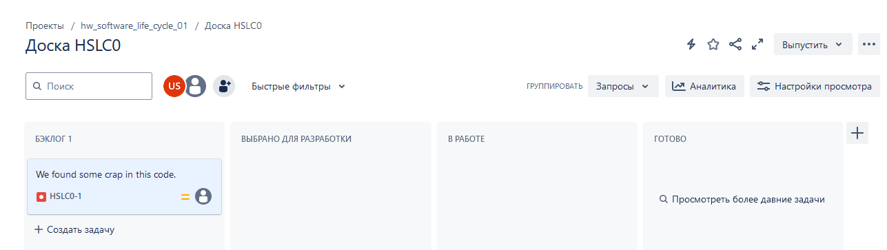
     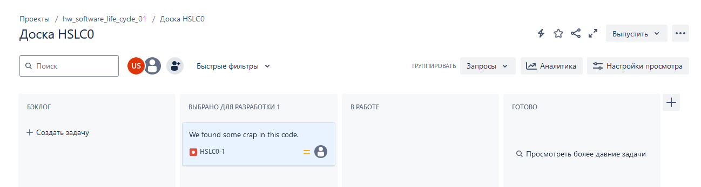
     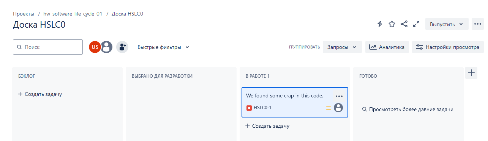
     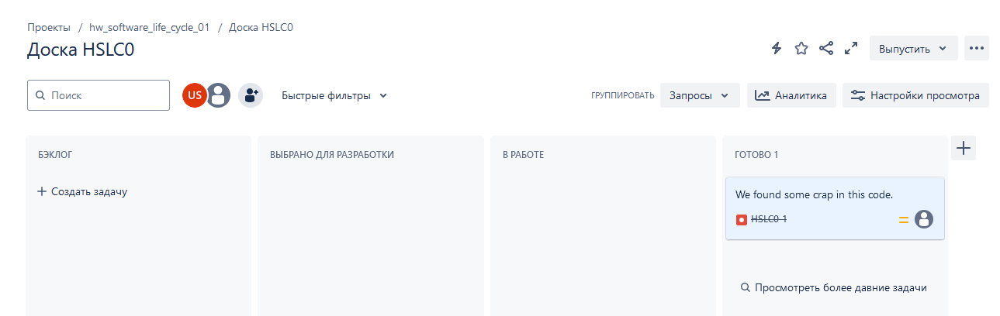
2. Создал задачу с типом epic, к ней привязал несколько задач с типом task, провёл их по всему workflow до Done. 
     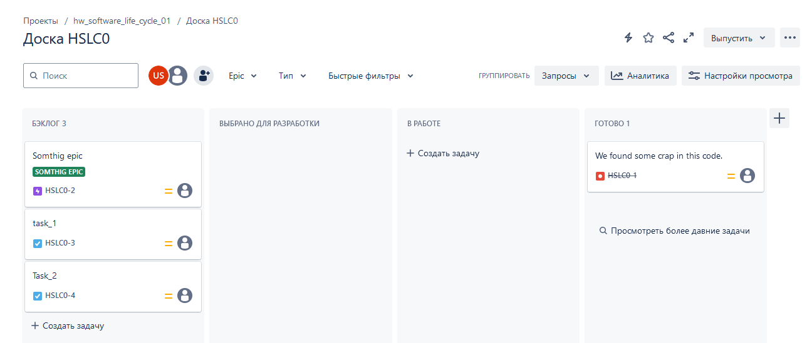
     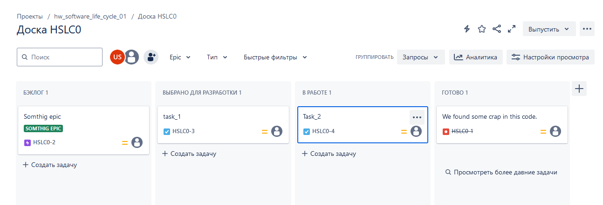
     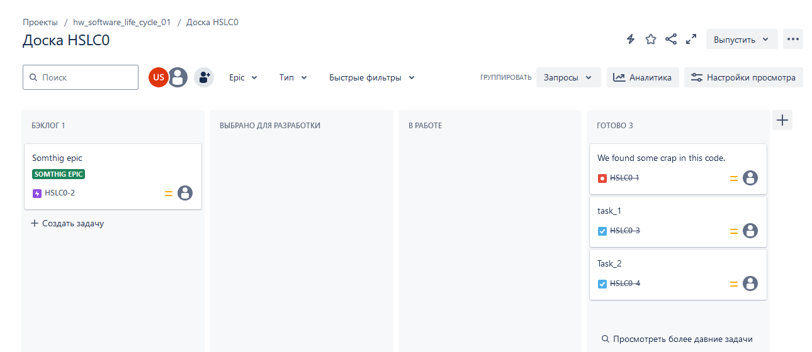
     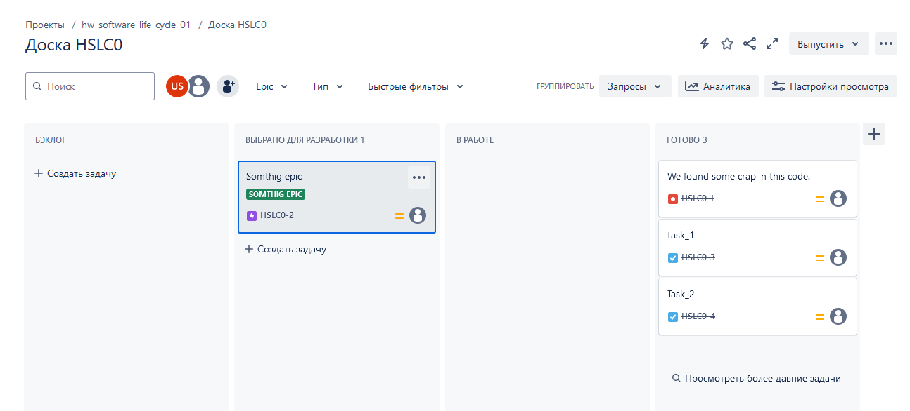
     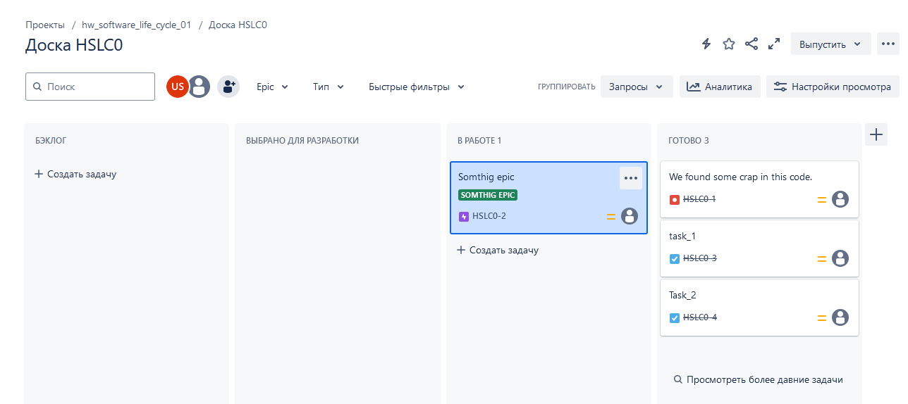
     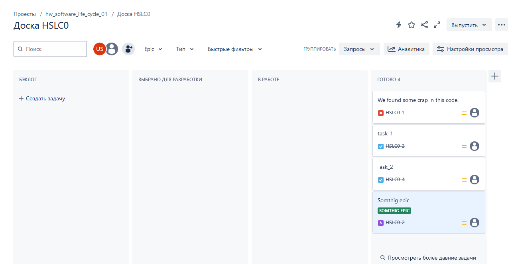
3. Вернул задачи в статус Open.
     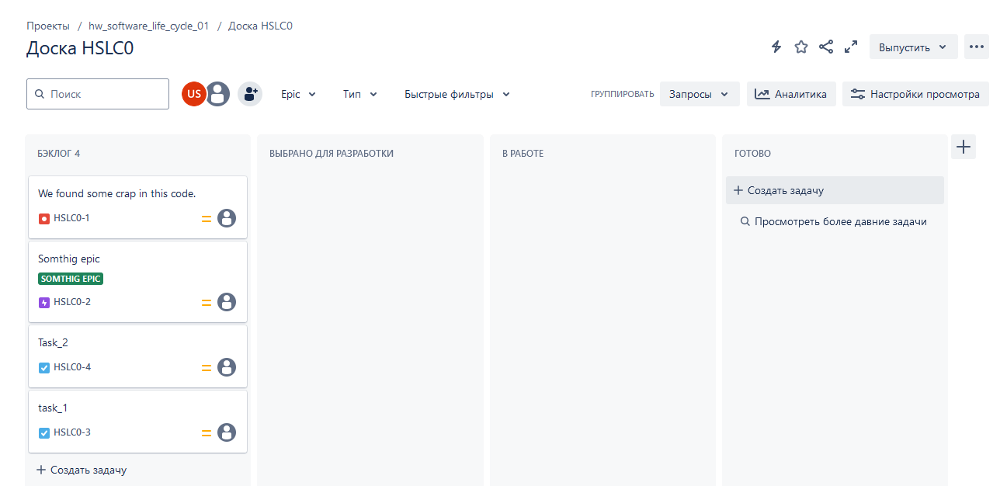
4. Перешёл в Scrum, запланировал новый спринт, состоящий из задач эпика и одного бага, стартовал спринт, провёл задачи до состояния Closed. Закрыл спринт. 
     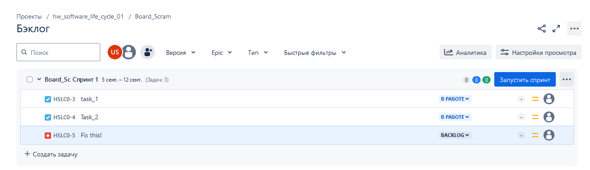
     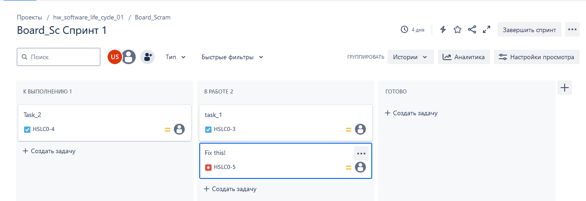
     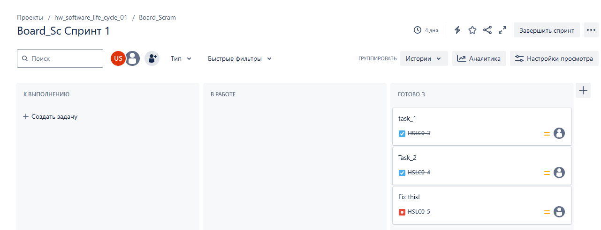
     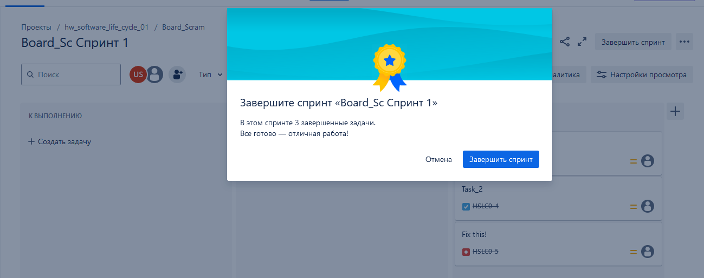
5. Выгрузил схемы workflow для импорта в XML. [Файл](SearchRequest.xml) с workflow приложил к решению задания.
